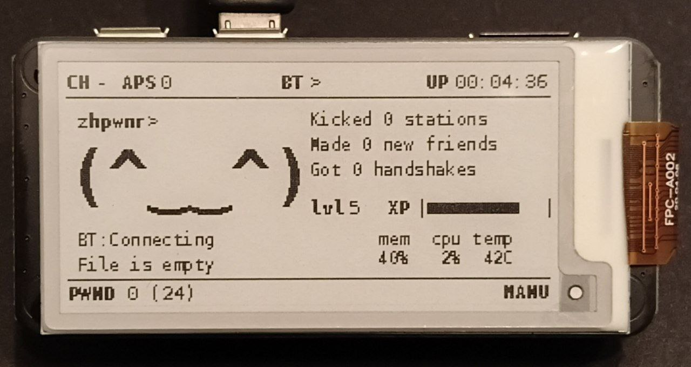

# Experience-Plugin-Pwnagotchi

A totally not useful plugin for the Pwnagotchi, making it get experience everytime he Associates, Deauths or get a Handshake. Try to level him up!
Based on Gaelic Thunder's work. Updated for the jayofelony's pwnagotchi image - https://github.com/jayofelony/pwnagotchi/




## Setup
1. Copy over `exp.py` into your custom plugins directory (usually `/usr/local/share/pwnagotchi/custom-plugins/`)
2. Please check that you do not have any similar plugins already! Like `xp.py`.
3. In your `config.toml` file (use the `config` command for that), add:
```toml
   [main.plugins.exp]
   enabled = true
   lvl_x_coord = 156
   lvl_y_coord = 72
   exp_x_coord = 196
   exp_y_coord = 72
   bar_symbols_count = 12
```
3. Restart your device to see your new plugin! You can use the `pwnkill` command for that.


## Things to do
  
- [x] Better Save System -> Saves are now in json Format and will per default migrate.
  
- [x] Make him count how many Handshake you have already captured and try to make a fair level up if you're not starting from zero, and you just installed the plugin [Example: if i already have 250 Handshake when i start the plugin for the first time, my Pwnagotchi will only be lv 1, while it should be lv 13(?)] -> if session-stats Plugin is installed, initially the data will be parsed from there. If not, just the last session will be counted.

- [x] Make Things configurable through settings.

- [ ] Testing, lots of testing.
